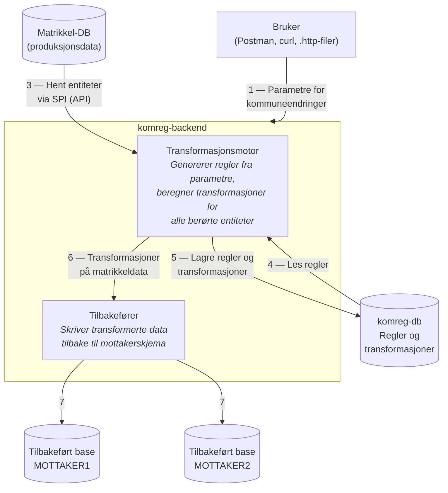
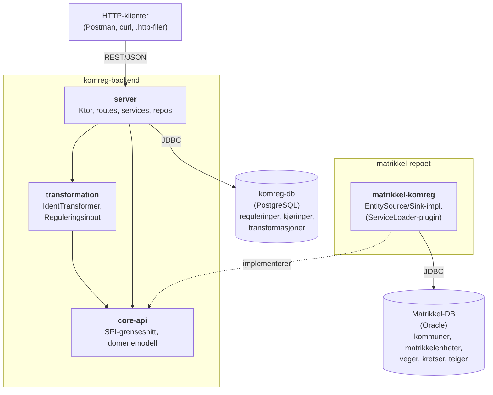
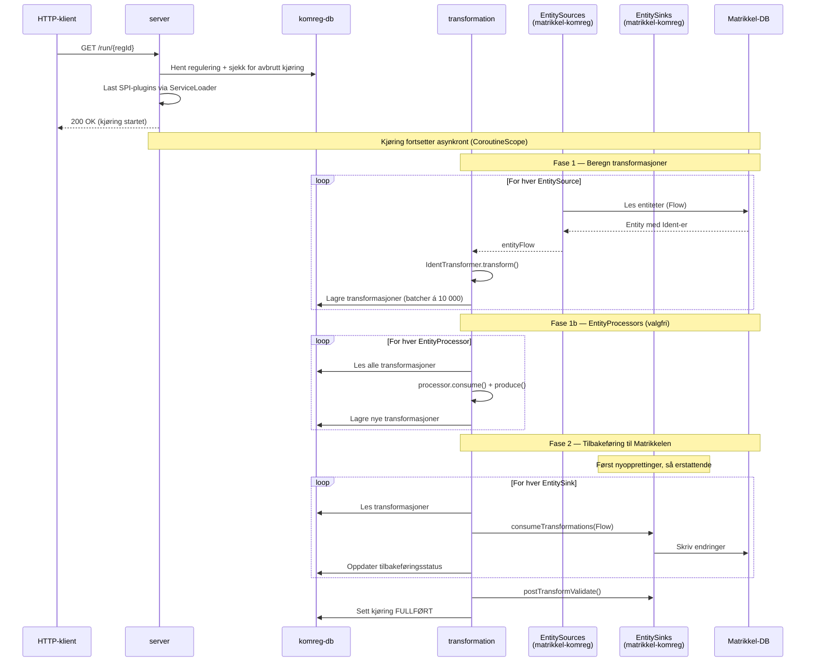
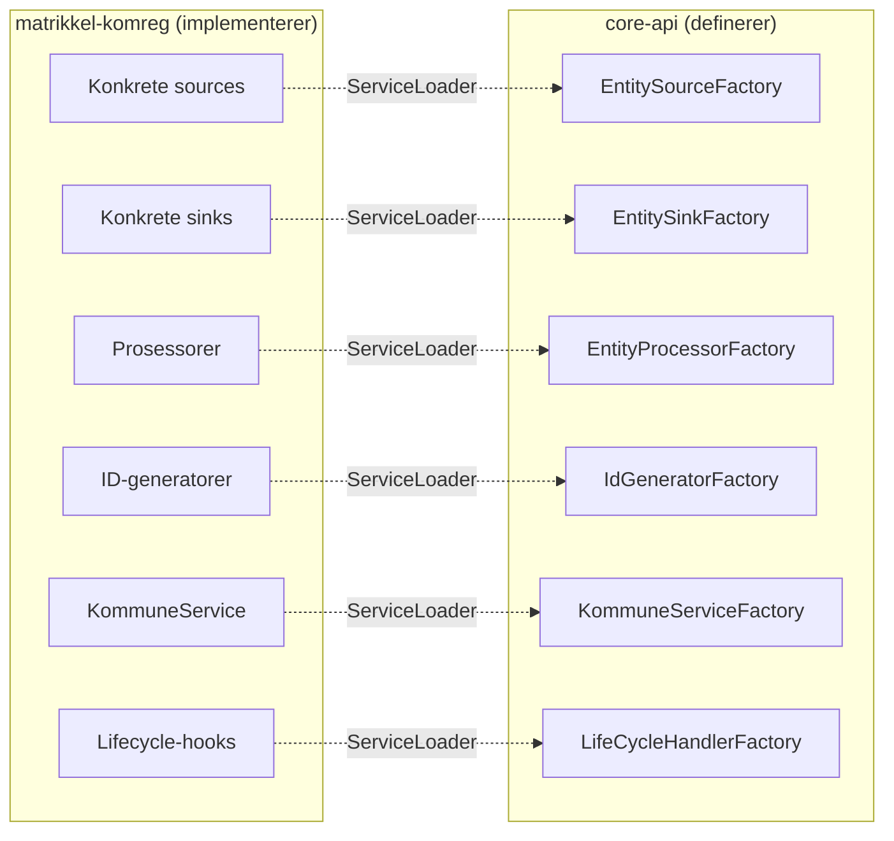

# Arkitektur

## Konseptuell dataflyt

Slik flyter data gjennom systemet ved en kommuneendring:

**Flyten steg for steg:**

1. Bruker oppretter en regulering med parametere som beskriver kommuneendringen (hvilke kommuner, fylker, gårdsnummer, veger osv. som berøres).
2. Matrikkel-DB inneholder produksjonsdata — alle eksisterende kommuner, matrikkelenheter, veger, kretser og teiger.
3. Transformasjonsmotoren henter berørte entiteter fra Matrikkelen via SPI-laget (EntitySources). Motoren vet ikke hvordan Matrikkelen er organisert internt — den jobber kun med generiske `Entity`/`Ident`-objekter.
4. Motoren genererer regler basert på parameterne. Eksempel: *"Matrikkelenhet med kommunenummer 3007 og gårdsnummer 6 → nytt kommunenummer 3107, gårdsnummer 600"*.
5. Regler og de resulterende transformasjonene lagres i komreg-db.
6. Tilbakeføreren leser transformasjonene og anvender dem på matrikkeldata via SPI-laget (EntitySinks). Her endres hele matrikkelobjekter — ikke bare identene, men også tilhørende forretninger.
7. Endringene skrives til et mottakerskjema (`MOTTAKER1` eller `MOTTAKER2`). På ikrafttredelsesdatoen bytter Matrikkelen til dette skjemaet som det aktive — da er kommuneendringen gjennomført.

## Systemarkitektur

Heltrukne piler er Gradle-avhengigheter. Den stiplede pilen er en _kjøretidskobling_: matrikkel-komreg implementerer SPI-grensesnittene i core-api og lastes via Java `ServiceLoader` — ingen compile-time-avhengighet fra komreg til matrikkel-komreg.

## Moduler

### core-api

Definerer det felles "språket" mellom komreg og Matrikkelen:

- **Domenemodell:** `Entity`, `Ident`, `Kommune`, `Fylke`, `Matrikkelenhet`, `TeigId`, osv.
- **SPI-grensesnitt:** `EntitySource`, `EntitySink`, `EntityProcessor`, `IdGenerator`, `KommuneService`, `LifeCycleHandler`
- **Factories:** `EntitySourceFactory`, `EntitySinkFactory` osv. — oppdages via Java `ServiceLoader`

core-api publiseres til Nexus slik at matrikkel-repoet kan bruke det som avhengighet.
Se [delte-biblioteker.md](delte-biblioteker.md) for detaljer om publiseringsflyten.

### transformation

Ren transformasjonslogikk uten avhengigheter til infrastruktur.

Sentrale klasser:
- `Reguleringsinput` — inputmodell med fylker, kommuner og endringer
- `IdentTransformer` — selve omnummereringsalgoritmen
- `Transformer.transform()` — orkestrerer hele flyten: source → transform → storage → sink

Støttede endringstyper:

| Type                    | Beskrivelse                         |
|----------------------|-------------------------------------|
| `Fylkeendring`       | Fylkessammenslåing/-splitting       |
| `Kommuneendring`     | Kommunesammenslåing/-splitting      |
| `Matrikkelenhetendring` | Flytting av gårdsnummer/bruksnummer |
| `Kretsendring`       | Endring av stemmekretser o.l.       |
| `Vegendring`         | Endring av vegnavn/adressekoder     |
| `Vegadresseendring`  | Endring av enkeltvegadresser        |
| `Teigendring`        | Endring av teiger                   |

### server

Ktor-applikasjonen som eksponerer REST-API og binder alt sammen.

**Lag:**
- **Routes** — HTTP-endepunkter (regulering, kjøring, grunndata, stedsnavn, intern)
- **Services** — forretningslogikk (`ReguleringService`, `KjoringService`, `TransformationService`)
- **Repositories** — PostgreSQL-tilgang (`ReguleringRepo`, `KjoringRepo`, `TransformationRepo`, `TilbakeføringsstatusRepo`)
- **Integration** — SPI-managere som laster matrikkel-komreg-implementasjoner via ServiceLoader

## Transformasjonsflyten

En transformasjon trigges med `GET /run/{regId}`.

**Viktige detaljer:**

- Kjøringen er **asynkron** — HTTP-kallet returnerer umiddelbart, selve arbeidet kjører i en coroutine på `Dispatchers.IO`.
- Hvis en kjøring avbrytes (pod restart, feil), kan den **gjenopptas**. `tilbakeføringsstatus` holder styr på hvilke sinks som gjenstår.
- `TOGGLE_SINK_OFF=true` hopper over tilbakeføring — nyttig under utvikling for å bare beregne transformasjoner uten å skrive til Matrikkelen.

## Kobling mot Matrikkelen (SPI-modellen)

Koblingen mot Matrikkelen er designet som en plugin-arkitektur via Java `ServiceLoader`:

**Hvorfor SPI?** KOMREG vet ikke noe om Matrikkelens interne datamodell. core-api definerer et generisk `Entity`/`Ident`-begrep. matrikkel-komreg vet hvordan man oversetter mellom dette og de faktiske Oracle-tabellene. Denne grensen gjør det mulig for de to repoene å utvikles uavhengig — så lenge SPI-kontrakten i core-api holdes stabil.

## Bruksmønster

En typisk arbeidsflyt for å kjøre en kommuneendring:

1. **Velg mottakerskjema** — `POST /skjema` med `MOTTAKER1` eller `MOTTAKER2`. Sikrer at man ikke skriver til et skjema som er eksponert mot brukere.
2. **Opprett regulering** — `POST /reguleringer` med en JSON-payload som beskriver ikrafttredelsesdato, involverte fylker og kommuner.
3. **Legg til endringer** — `POST /reguleringer/{id}/endringer` for hver endring (kommunesammenslåing, matrikkelenhetsflytting, vegendring, osv.).
4. **Kjør transformasjon** — `GET /run/{regId}`. Kjøringen starter asynkront og kan ta lang tid avhengig av datamengde.
5. **Verifiser** — Sjekk kjøringsstatus, transformasjonsresultater, og eventuelt M22-klienten for å se endringene visuelt.

### Mottakerskjema og skjemabytte

Matrikkelen har to mutable mottakerskjema (`MOTTAKER1`, `MOTTAKER2`) pluss et `MATRIKKEL_BACKING`-skjema.
KOMREG skriver transformasjoner til et mottakerskjema som ikke er eksponert mot brukere.
`SchemaManager` holder styr på hvilket skjema som er ledig.

På ikrafttredelsesdatoen bytter Matrikkelen hvilket skjema som er "live" — da blir mottakerskjemaet
med de transformerte dataene til det aktive skjemaet. KOMREG har ingen egen endringslogg;
endringene blir en del av Matrikkelens vanlige endringslogg etter skjemabyttet.

### Tilbakeføring

Etter at transformasjoner er beregnet, kjøres tilbakeføring i to faser:
1. **Nyopprettinger** — entiteter som ikke fantes fra før (nye kommuner, nye matrikkelenheter)
2. **Erstattende entiteter** — eksisterende entiteter som får nye identer

Hver sink spores med egen status (`TILBAKEFØRER`, `FERDIG`, `FEILET`) i `tilbakeføringsstatus`-tabellen,
noe som gjør det mulig å gjenoppta en avbrutt kjøring.

## Databaser

### komreg-db (PostgreSQL)

| Tabell                  | Beskrivelse                                         |
|-------------------------|-----------------------------------------------------|
| `regulering`            | Reguleringsinput (JSONB-payload)                    |
| `kjoring`               | Kjøringsstatus, start/stopp, mottakerskjema         |
| `transformasjon`        | Beregnede transformasjoner (source → target ident)  |
| `mottakerskjema`        | Hvilke mottakerskjema som er ledige                 |
| `tilbakeføringsstatus`  | Status per sink per kjøring                         |
| `id_cache`              | Cache for ID-mappinger                              |

Skjemamigreringer håndteres av Flyway.

### Matrikkel-DB (Oracle)

KOMREG kobler seg til Matrikkelen via JDBC (Oracle). Tilkoblingen brukes av
matrikkel-komreg-implementasjonene (sources og sinks).

## API-endepunkter

| Gruppe      | Endepunkter                                             | Beskrivelse                        |
|-------------|---------------------------------------------------------|------------------------------------|
| Regulering  | `GET/POST/PUT/DELETE /reguleringer`                     | CRUD for reguleringer              |
| Endringer   | `GET/POST/PUT/DELETE /reguleringer/{id}/endringer`      | CRUD for endringer i en regulering |
| Kjøring     | `GET /run/{regId}`                                      | Start/gjenoppta transformasjon     |
| Skjema      | `POST /skjema`                                          | Velg mottakerskjema                |
| Grunndata   | `GET /fylker`, `GET /kommuner`                          | Oppslag av fylke-/kommunedata (via SPI) |
| Stedsnavn   | `GET /stedsnavn/json/{kjoring}`                         | Eksport til SSR-format             |
| Intern      | `GET /actuator/health`, `GET /actuator/metrics`         | Helsesjekk og Prometheus-metrikker |
