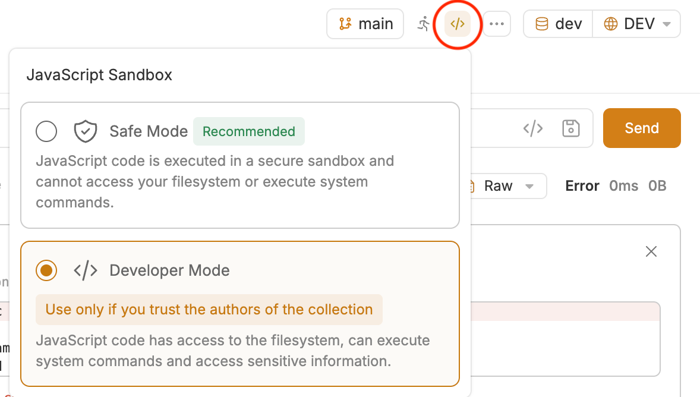

# Bruno

Az-cli må være satt opp, se README.

### Gjør az tilgjengelig for Bruno (Mac)

På mac kan det hende at Bruno desktop appen ikke finner pathen til az. 
Kjør denne kommandoen for å gjøre az tilgjengelig i en shell path som er synlig for desktop appen (gitt at det er installert med homebrew): 

```bash
sudo sh -c 'echo "#!/bin/bash\n/opt/homebrew/bin/az \"\$@\"" > /usr/local/bin/az && chmod +x /usr/local/bin/az'
```

### Åpne collection i Bruno

Åpne Bruno og åpne `http/bruno/KomReg` som collection

### Aktiver Developer Mode

Bruno v3 kjører som standard i Safe Mode, som ikke støtter native Node.js-moduler, inkl. 'child_process' modulen vi bruker. 
Oppe i høyre hjørne er det en badge som kan trykkes på for å endre til Developer Mode



### Finn miljøinnstillingene

Åpne Bruno og naviger til Environments (oppe til høyre) ➔ Settings.

### Fyll inn variabler

Velg miljøet du skal sette opp (DEV eller PROD). Du trenger kun å fylle inn verdier for følgende to
variabler:

- baseUrl: <url>
- clientId: Denne finner du i Entra ID (se README.md for mer informasjon).

Andre variabler vil bli satt automatisk.

### Om "Secrets"

De andre variablene som settes automatisk, inneholder selve tokenet og er de aller viktigste å
beskytte. For å unngå at verken tokens, baseUrl eller clientId ved et uhell blir lagret i
kildekoden, er disse feltene satt opp som Secret i Bruno.

Fordi "Secret"-verdier kun lagres lokalt på din egen maskin og ikke deles i Git, vil baseUrl og
clientId være tomme som standard. Derfor må hver utvikler fylle inn disse manuelt første gang. Sørg
for at "Secret"-markeringen forblir aktivert for alle disse feltene.